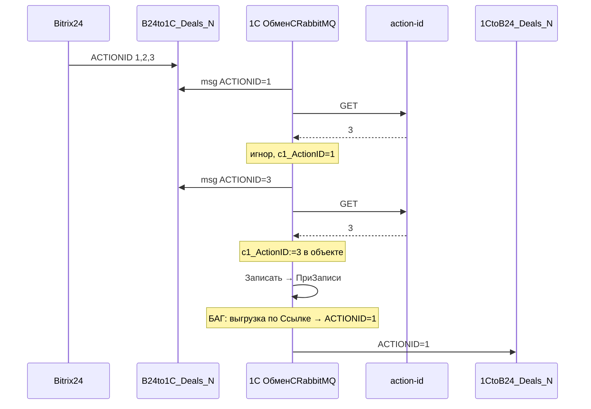

# Отчёт: баг ACTIONID — обработка сделки Н (B24to1C → 1CtoB24)

**Дата:** 19.06.2026  
**Модуль 1С:** `с1_риэ_ОбменCRabbitMQ` (выгрузка ~9558 строк)  
**Пакет:** самодостаточный, см. [README.md](./README.md)

---

## 1. Ожидаемая логика

```
B24: UF_CRM_ACTIONID++ при каждом исходящем событии → очередь B24to1C_Deals_N
     ↓
Сообщения: ACTIONID = 1, 2, 3 …
     ↓
1С для каждого сообщения:
  GET /api/crm/deal/{id}/action-id → APIActionID
  APIActionID > MessageActionID → не применять тело (устаревшее)
  иначе → применить, с1_ActionID = MessageActionID
     ↓
Ответ 1CtoB24_Deals_N: ACTIONID = актуальный с1_ActionID
```

### Пример

| | Значение |
|---|----------|
| Очередь | ACTIONID 1, 2, 3 |
| API CRM | **3** |
| 1С локально | **1** |
| После msg#3 | с1_ActionID = **3**, ответ с ACTIONID = **3** |

---

## 2. Симптом

1С не обновляет `с1_ActionID` (или обновляет только в памяти) и шлёт в `1CtoB24_Deals_N` **старый** ACTIONID.

---

## 3. Схема потока (где ломается)



---

## 4. Якоря в коде 1С

> Поиск по фрагментам в модуле `с1_риэ_ОбменCRabbitMQ`. Номера строк — по выгрузке.

### 4.1. Вход очереди B24to1C_Deals_N

**Поиск:** `B24to1C_Deals_N`  
**Строка:** ~127–136

```bsl
Ошибочка = с1_Б24_СоздатьСделкуСНедвижимостьюПоДаннымИзAPI(ДанныеЛида);
```

### 4.2. Чтение ACTIONID из сообщения

**Поиск:** `#Область Action_ID` + `ДанныеЛида.ACTIONID`  
**Строка:** ~5548–5551

### 4.3. ⚠️ Главный баг — существующая сделка Н

**Поиск:** `Если ДокументСделкаН.с1_ActionID > ЭкшнИД Тогда`  
**Строка:** ~5985–5998

| # | Проблема |
|---|----------|
| A | При игноре (`API > Message`) — нет обновления и записи `с1_ActionID` |
| B | При применении: `с1_ActionID = ЭндпоинтИДСделки` вместо `ЭкшнИД` |
| C | Нет `с1_ЗагрузкаИзБитрикса` перед записью (~6270) |
| D | Логика расходится со сделкой К (~5110) |

Закомментированный вариант с записью при игноре: ~6000–6018.

### 4.4. Эталон — сделка К

**Поиск:** `ДокументСделкаК.с1_ActionID > ЭкшнИД`  
**Строка:** ~5110–5130 — при устаревшем msg **продвигает** `с1_ActionID` и **Записать()**.

### 4.5. ⚠️ Разбор JSON action-id

**Поиск:** `Функция ЗапроситьActionIDСделки`  
**Строка:** ~5270 — `СтруктураЗапроса.ActionID`, API отдаёт **`ACTIONID`**.

См. [endpoint-action-id.md](./endpoint-action-id.md).

### 4.6. Исходящая очередь

**Поиск:** `"1CtoB24_Deals_N"`  
**Строка:** ~6979–6987 — `ЗаписатьЗначение(Источник.с1_ActionID)`.

### 4.7. ⚠️ ПриЗаписи — Ссылка вместо объекта

**Поиск:** `с1_Б24_ОбъектыДляБитриксПриЗаписи`  
**Строка:** ~291 — `с1_Б24_ВыгрузкаСделкиСНедвижимостьюВБитрикс(Источник.Ссылка)`  
**Строка:** ~224–232 — guard `с1_ЗагрузкаИзБитрикса` **закомментирован**.

---

## 5. Сторона B24 (без правок)

См. [b24-api-context.md](./b24-api-context.md).

---

## 6. Что поправить (приоритет)

### P0

1. `ЗапроситьActionIDСделки` — ключ `ACTIONID` → [patch-minimal.bsl](./patch-minimal.bsl) §1  
2. Блок ~5985–5998 сделки Н → [patch-minimal.bsl](./patch-minimal.bsl) §2 или [integration-snippet-deal-n.bsl](./integration-snippet-deal-n.bsl)  
3. `ПриЗаписи`: объект + guard → [patch-minimal.bsl](./patch-minimal.bsl) §3–4  
4. Флаг `с1_ЗагрузкаИзБитрикса` перед ~6270

### P1

5. Общий модуль [с1_DealActions_Module.bsl](./с1_DealActions_Module.bsl)  
6. Синхронизировать логику сделки К и Н

---

## 7. Сводная таблица якорей

| Участок | Поиск | Строка | Действие |
|---------|-------|--------|----------|
| Очередь B24→1C Н | `B24to1C_Deals_N` | ~127 | вход |
| ACTIONID из msg | `ДанныеЛида.ACTIONID` | ~5549 | ок |
| Проверка сделки Н | `ДокументСделкаН.с1_ActionID > ЭкшнИД` | ~5985 | **переписать** |
| HTTP action-id | `ЗапроситьActionIDСделки` | ~5243 | **fix JSON** |
| Сделка К (эталон) | `ДокументСделкаК.с1_ActionID` | ~5110 | образец |
| Запись сделки Н | `ДокументСделкаН.Записать` | ~6270 | + флаг B24 |
| ПриЗаписи | `ОбъектыДляБитриксПриЗаписи` | ~163 | guard + объект |
| Выгрузка 1C→B24 | `1CtoB24_Deals_N` | ~6996 | ACTIONID |

---

## 8. Проверка после исправления

1. B24 и 1С: ACTIONID = 0.  
2. Три изменения сделки в B24 → msg с ACTIONID 1, 2, 3.  
3. Обработка 1С: msg 1–2 игнор; `с1_ActionID` → 3; msg 3 применён.  
4. `1CtoB24_Deals_N`: ACTIONID = 3.  
5. CRM `UF_CRM_ACTIONID` = 3.

---

## 9. Файлы пакета

| Файл | Назначение |
|------|------------|
| [README.md](./README.md) | оглавление |
| [ОТЧЕТ.md](./ОТЧЕТ.md) | этот документ |
| [patch-minimal.bsl](./patch-minimal.bsl) | быстрый патч |
| [integration-snippet-deal-n.bsl](./integration-snippet-deal-n.bsl) | вставка через с1_DealActions |
| [с1_DealActions_Module.bsl](./с1_DealActions_Module.bsl) | общий модуль |
| [endpoint-action-id.md](./endpoint-action-id.md) | контракт API |
| [b24-api-context.md](./b24-api-context.md) | справка PHP/B24 |
